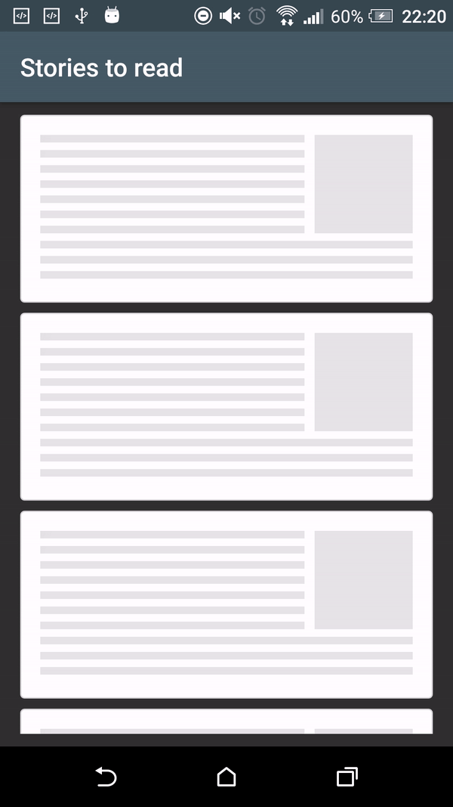
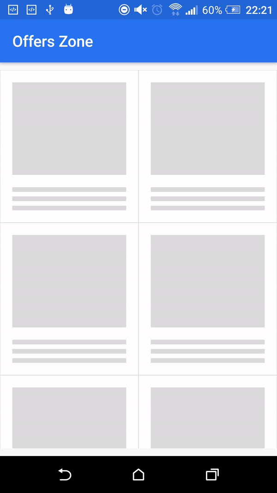

[](https://jitpack.io/#appuraja1/shimmer-recyclerview)
[](https://android-arsenal.com/api?level=23)

# ShimmerRecyclerView

A custom RecyclerView with animated shimmer loading views to smoothly indicate background data loading. Built completely for modern **AndroidX**, Kotlin, and modern Gradle toolchains.

It includes a built-in adapter to control the shimmer effect:
* `showShimmerAdapter()` - Displays demo shimmer items while data is fetching.
* `hideShimmerAdapter()` - Restores your original adapter and displays actual data.

---

## Demo

There are two kinds of shimmer animations available:

### 1. Full ViewHolder Animation
The entire ViewHolder item animates across the surface.

| List Demo | Grid Demo |
| :---: | :---: |
|  |  |

### 2. Selective View Mask Animation
The shimmer effect is only visible over child views with non-transparent backgrounds.

| List Demo | Grid Demo |
| :---: | :---: |
|  |  |

---

## Shimmer Effect Setup

1. **Full Animation:** All child views inside your demo layout should have non-transparent backgrounds.
2. **Selective Animation:** Add a parent ViewGroup with a transparent background, and set non-transparent backgrounds only to the child views (e.g., TextViews or ImageViews) you want to shimmer. Use `app:shimmer_demo_view_holder_item_background` to set an overall background for the ViewHolder if needed.

---

## XML Attributes & Methods

| XML Attribute | Kotlin / Java Method | Description |
| :--- | :--- | :--- |
| `app:shimmer_demo_child_count` | `setDemoChildCount(count: Int)` | Total count of shimmer placeholder items. |
| `app:shimmer_demo_grid_child_count` | `setGridChildCount(count: Int)` | Number of columns when using a Grid layout. |
| `app:shimmer_demo_layout` | `setDemoLayoutReference(resId: Int)` | Layout resource reference (`@layout/my_placeholder`). |
| `app:shimmer_demo_layout_manager_type` | `setDemoLayoutManager(type: LayoutManagerType)` | Layout type: `linear_vertical`, `linear_horizontal`, or `grid`. |
| `app:shimmer_demo_shimmer_color` | — | Color of the shimmer wave line. |
| `app:shimmer_demo_angle` | — | Shimmer wave angle (0 to 30 degrees). |
| `app:shimmer_demo_mask_width` | `setDemoShimmerMaskWidth(width: Float)` | Width ratio of the shimmer line (0.0 to 1.0). |
| `app:shimmer_demo_duration` | `setDemoShimmerDuration(duration: Int)` | Animation duration in milliseconds. |
| `app:shimmer_demo_view_holder_item_background` | — | Background drawable or color for the shimmer ViewHolder. |
| `app:shimmer_demo_reverse_animation` | — | Reverse animation direction (right-to-left). Default is `false`. |

---

## Installation

### 1. Add JitPack repository
Add it to your root `settings.gradle` inside `dependencyResolutionManagement`:

```groovy
dependencyResolutionManagement {
    repositoriesMode.set(RepositoriesMode.FAIL_ON_PROJECT_REPOS)
    repositories {
        google()
        mavenCentral()
        maven { url '[https://jitpack.io](https://jitpack.io)' }
    }
}
```

### 2. Add Dependency
Add this to your app module's `build.gradle`:

```groovy
dependencies {
    implementation 'com.github.appuraja1:shimmer-recyclerview:v1.0.0'
}
```

---

## Usage

### XML Layout
```xml
<com.appuraja.views.shimmer.ShimmerRecyclerView
    android:id="@+id/shimmer_recycler_view"
    android:layout_width="match_parent"
    android:layout_height="match_parent"
    app:shimmer_demo_child_count="10"
    app:shimmer_demo_grid_child_count="2"
    app:shimmer_demo_layout="@layout/layout_demo_grid"
    app:shimmer_demo_layout_manager_type="grid"
    app:shimmer_demo_angle="20" />
```

### Activity / Fragment Setup (Kotlin)
```kotlin
val shimmerRecycler = findViewById<ShimmerRecyclerView>(R.id.shimmer_recycler_view)

// Show shimmer animation placeholder
shimmerRecycler.showShimmerAdapter()

// Load actual data and restore normal adapter
myViewModel.loadData { actualList ->
    myActualAdapter.submitList(actualList)
    shimmerRecycler.adapter = myActualAdapter
    shimmerRecycler.hideShimmerAdapter()
}
```

---

## Developed & Maintained By

* **Appu Raja**

Based on the original work by [Harish Sridharan](https://github.com/sharish).

## Credits

* [ShimmerLayout](https://github.com/team-supercharge/ShimmerLayout)

## License

```text
Copyright 2026 Appu Raja

Licensed under the Apache License, Version 2.0 (the "License");
you may not use this file except in compliance with the License.
You may obtain a copy of the License at

   [http://www.apache.org/licenses/LICENSE-2.0](http://www.apache.org/licenses/LICENSE-2.0)

Unless required by applicable law or agreed to in writing, software
distributed under the License is distributed on an "AS IS" BASIS,
WITHOUT WARRANTIES OR CONDITIONS OF ANY KIND, either express or implied.
See the License for the specific language governing permissions and
limitations under the License.
